# Lesson 1

## The Setup

Before we begin building our Jekyll website, we will need to install a few applications and package managers.

### 1. Install Apple's Developer Tools

`xcode-select --install`

### 2. Install Homebrew Package Manager

>More information on the [Homebrew website](http://brew.sh).

`/usr/bin/ruby -e "$(curl -fsSL https://raw.githubusercontent.com/Homebrew/install/master/install)"`

Now we will test that everything is ready to go by typing:

`brew doctor`

If all goes well we will see `Your system is ready to brew.`.

### 3. Install Ruby

`brew install ruby`

Then we test to make sure we are ready to use ruby gems. Gems are how we install ruby packages just like how we used `brew` for Homebrew above. To do this we type:

`which gem`

We should see `/usr/local/bin/gem`. This means we are ready to install Jekyll.

### 4. Install Jekyll

`gem install jekyll`

Once the Jekyll installation is complete, we can type:

`which jekyll` to see `/usr/local/bin/jekyll`

and:

`jekyll -v` to see `jekyll 3.1.1` which is the current version at the time of this tutorial.

### 5. Create and Setup a GitHub Account

> GitHub is now using the latest major release of Jekyll, Jekyll 3.0. You can read more about it [here](https://github.com/blog/2100-github-pages-now-faster-and-simpler-with-jekyll-3-0).

Head over to [GitHub.com](https://github.com) and create a free account.

Once our account is created and we are logged in, let's create our repository or *repo* for short.

Click the plus sign at the top right and select __New repository__

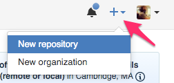

Now we can setup a name, description, and settings for our repo. We can make this repo private but that requires a premium account. We will keep it public for now since we are focusing on free hosting.

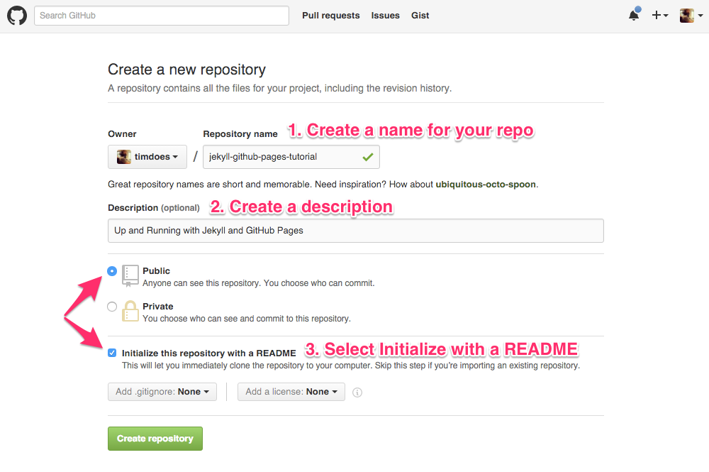

After we click __Create repository__ we will be taken to our newly created repo (seen below).

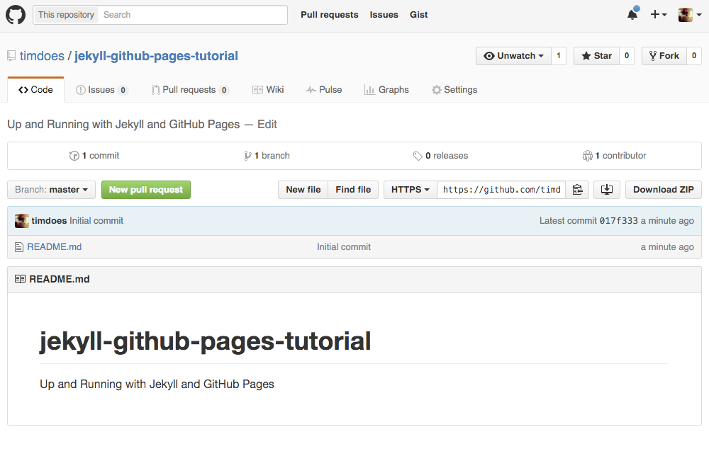

> If you are new to git read this section
>
> Before we continue I'd like to explain a few things about git. Our repository or repo for short, is a folder/directory with a hidden folder named `.git` in it. This is where the state of our files is kept with a full history of all the changes we make. Each time we want to save the state of our project/repo/folder, we make a __commit__ (snapshot) with a title and optional description to inform us/everyone about what changes were made. This also allows us to easily undo a breaking change by simply reverting a commit.
>
>Now on to __branches__. Branches are a way to collaborate with other people as well as safely work on features without messing up the main (master) state of the project files. We won't dive too deep into branches in this tutorial.

Since we are using this repo with GitHub Pages for hosting, we need to create a branch named `gh-pages`

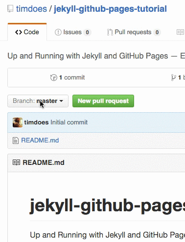

Now we have two branches. `master` and `gh-pages`. Since we won't be using this repo for sharing files, but for hosting our website, we need to set the `gh-pages` branch as default. Then we can remove the `master` branch.


### 6. Install and Setup GitHub Desktop

Let's install GitHub Desktop so that we can easily manage our repo. [Download GitHub Desktop](https://desktop.github.com).

When we open GitHub Desktop for the first time we will need to sign-in to connect our GitHub account. Then we will need to [configure git for GitHub Desktop](https://help.github.com/desktop/guides/getting-started/configuring-git-for-github-desktop/) in the Advanced tab. All we need to do is specify our full name and email address (the one we used for GitHub) so all our git actions will have our author info. Lastly, we will install the github command line tools (this is optional but recommended).

If you prefer to install git manually first, you can head over to [git-scm.com](https://git-scm.com/downloads).

### 7. Copy/Clone our Repo to our Computer

We can head back to our repo on GitHub and click the Clone in Desktop button (icon w/ monitor with a down arrow) next to the Download button.

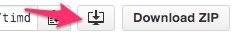

This will open our GitHub Desktop app and now we will select the location to download (I will use my Projects folder) and click Clone.

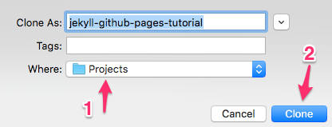

We should now see our newly created repo in our GitHub Desktop app and see the new folder where we saved it.

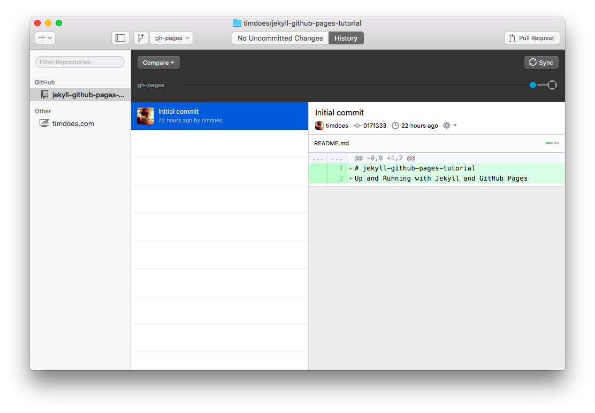

### 8. Create our First Test Page

In this section we will create our first test page and deploy it to GitHub. For now we will use some example HTML just so we can test that everything is working properly.

Let's open our project in our IDE. If you are using Atom like me, you can right click the repo in GitHub Desktop and select `Open in Atom`.

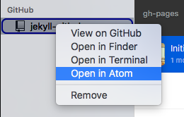

Let's right click in the left tree view area and select `New File`. Name the file __index.html__ (make sure the file is in the root directory _/index.html_). Then paste the following code in the file and save it.

```HTML
<!DOCTYPE html>
<html>
  <head>
    <meta charset="utf-8">
    <title>My Jekyll Website</title>
  </head>
  <body>
    <h1>My Jekyll Website</h1>
  </body>
</html>
```

Once that is saved, we can pop back over to our GitHub Desktop app to see we have 1 Uncommitted Change.

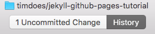

Let's go ahead and click __1 Uncommitted Change__. Now we should see our new __index.html__ file ready to be committed and pushed to our hosting (GitGub).

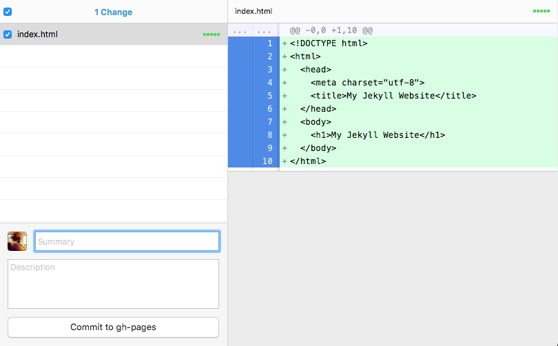

Make sure that the checkbox next to the file name is checked. Then  we will create a title for our commit by typing `Test HTML file` (or whatever you want to call it) in the input box labelled Summary. Then click __Commit to gh-pages__.

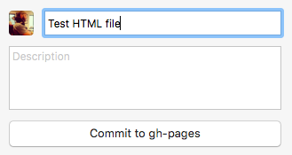

The next step is to push our new file up to GitHub by clicking the __Sync__ button in the top left corner.


That's it! Now our first webpage is live and ready for everyone to see. To see it in action, let's head on over to our repo on the GitHub website, click __Settings__ in the menu, then scroll down to find the url for our website.

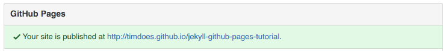

Click it and you will now see your website in action.

Remember that so far we have only setup our development environment, setup our hosting (GitHub), and created a test HTML file to make sure everything is working.

In the next Lesson we will get into the fun stuff, creating our first Jekyll project.

Continue to [Lesson 2: Creating A Jekyll Project](02-creating-a-jekyll-project.md).
