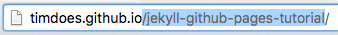
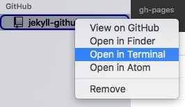
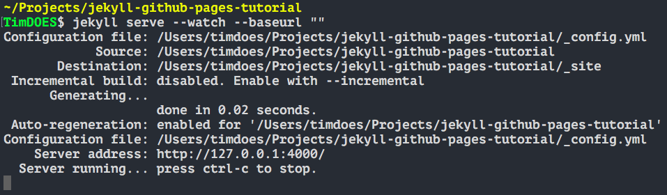
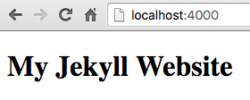
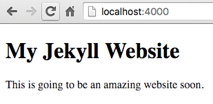
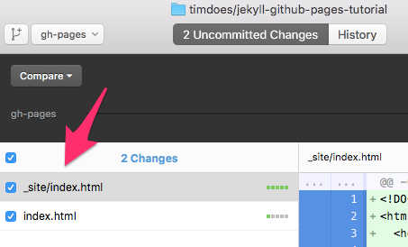
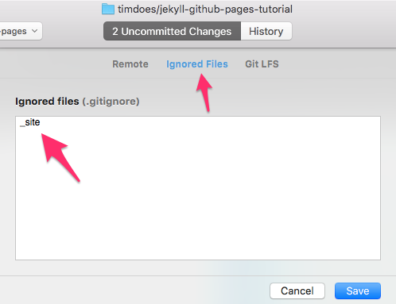
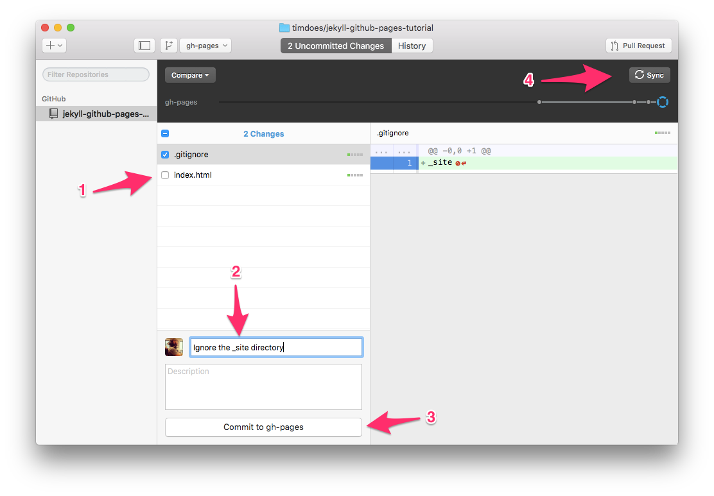
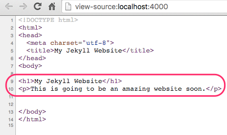

# Lesson 2

## Creating A Jekyll Project

### 1. Creating the *_config.yml* File

Now that our website is live and ready, we need to convert it to a Jekyll website. To do this, we need to create a **_config.yml** file in the root directory.

Paste the following code in the **_config.yml** file:

```yml
baseurl: /YOUR_REPO_NAME
exclude: ['README.md']
```

Let's break this down.

The first line specifies the base url for your website. This is the repo name that comes after the `github.io` in the address bar. For example, this tutorial's baseurl is  `/up-and-running-with-jekyll-and-github-pages` (notice there is no trailing slash). But for now let's make it a bit shorter and call it `/jekyll-github-pages-tutorial`.



```yml
baseurl: /jekyll-github-pages-tutorial
```

The second line tells Jekyll which files to exclude. Since the `README.md` file is solely for our GitHub repo and not the website, we can tell Jekyll to ignore this.

__Note:__ This is an array so if we wanted to exclude another file it would look like so:

```yml
exclude: ['README.md', 'second_file.txt']
```

Now that we have our config file, let's go ahead and:

1. Save
2. Commit
3. Sync

> Please refer to the last part of [Lesson 1, Section 8](01-the-setup.md) if you forgot how to commit and sync your changes to GitHub.

### 2. Starting / Stopping Jekyll

We now have Jekyll setup and ready to turn on. To do this, we need to open our command line tool (Terminal) at our project directory. A quick and easy way is to go to GitHub Desktop, right-click our repo in the left sidebar, and select __Open in Terminal__.



Once in Terminal, type `jekyll serve --watch --baseurl ""`.

Let's break this down. We start the Jekyll server by typing `jekyll serve`. Then we tell the server to watch for changes in our files by adding the `--watch` argument. And lastly, we reset the baseurl to nothing with the `--baseurl ""` argument. This is necessary because we set the baseurl to `baseurl: /jekyll-github-pages-tutorial` in our config file so that is will work on our GitHub hosting. But when we run our Jekyll website on our local computer, we don't need this so we must remove it.

Now hit `enter` and we should see something like:



This has started our server, created our  `_site` folder with our build files, and now we can access our website at `http://127.0.0.1:4000/` or more commonly `http://localhost:4000/`. Once we open the site up in our browser we see:



Now for fun (and to see edits in action), let's edit our `index.html` file to add some subtext. Let's put a paragraph tag under our `<h1>` so it looks like:

```html
<h1>My Jekyll Website</h1>
<p>This is going to be an amazing website soon.</p>
```

Save it then go back to the browser and refresh the page. Now we will see:



Remember that our Terminal must be open and our server must be running to see our website. If at any time we want to stop our server, we can either close the terminal window or type `Control` and `C` at the same time (`ctrl-c`).

We can restart our server at any time by typing `jekyll serve --watch --baseurl ""` or simply hitting the up arrow on our keyboard to cycle through our command history until we see the command `jekyll serve --watch --baseurl ""`. Then hit `enter`.

### 3. What's Up With This \_site Folder?

Well as I briefly mentioned in the last section, the `_site` folder is generated when we start are Jekyll server and when we save any files within our Jekyll project.

The contents of the `_site` folder are the actual code we are seeing when we view our website in the browser.

We can see in GitHub Desktop that the contents of our `_site` folder are added to the Uncommitted Changes tab, ready to be  committed.



But this is a temporary folder and we don't want to upload it to GitHub as it is unnecessary. We need to ignore it.

To do this we need to create a `.gitignore` file in our root directory with the following one line of code:

```
_site
```

We can simply create this folder in Atom or manage our ignored files/folders inside of GitHub Desktop itself. Go to __Repository__ => __Repository Settings...__ => __Ignored Files__ then type `_site` and click Save. This will create our `.gitignore` file for us.



Now we can see that the `_site` contents have been removed from the Uncommitted Changes and the `.gitignore` file has been added. Let's commit this to GitHub.

1. Uncheck the `index.html` changes
2. Name our commit
3. Commit the changes
4. (Sync) Push the changes to GitHub



### 4. Creating Layouts

So far, we haven't done anything Jekylly with our website. It's time to get down and dirty with our Jekyll features!

Let's start by creating Layouts.

When building websites, it's always best to focus on optimizing and reducing redundancy. This means not having the same code repeat in every file, making our repo huge and a nightmare to update.

Since there will be some code that we reuse on all of our pages, we can create layouts with that code, and then include them in every page. This way when we need to make an edit to our header, navigation, footer, etc., we can __edit once, update everywhere__.

In the root directory, create a folder named `_layouts`. And inside there, let's create a file called `default.html`.

Now we need to grab our common code from our `index.html` file and paste it in our default layout, `default.html`.

Our files should look like:

*/_layouts/default.html*
```html
<!DOCTYPE html>
<html>
<head>
  <meta charset="utf-8">
  <title>My Jekyll Website</title>
</head>
<body>

</body>
</html>
```

*/index.html*
```html
<h1>My Jekyll Website</h1>
<p>This is going to be an amazing website soon.</p>
```

Okay, this looks great but how does Jekyll know to put the content from `/index.html` into `/_layouts/default.html`? And where? Well, it doesn't. We will need to add a few more lines of code to tell it to do so.

First, let's add `{{content}}` to our layout. This tells our layout where we want our page content to be placed.

*/_layouts/default.html*
```html
...
<body>

{{content}}

</body>
...
```

Second, let's add some Yaml front matter to our `index.html` file so it knows which layout to use. The __front matter__ section starts with three dashes and ends with three dashes.

*/index.html*
```html
---
layout: default
---

<h1>My Jekyll Website</h1>
<p>This is going to be an amazing website soon.</p>
```

Now if we go back to our browser and refresh the page, we will see that nothing has changed. It has properly included our `index.html` content into our default layout.

We can even verify this by checking the page source. Right-click in the browser and select __View Page Source__. Here we can see that all of our content has been inserted into the `<body>` of our page.



Now we have an official Jekyll website! Let's save our changes and push them up to GitHub.

1. Save
2. Commit
3. Sync

> Please refer to the last part of [Lesson 1, Section 8](01-the-setup.md) if you forgot how to commit and sync your changes to GitHub.

Continue to [Lesson 3: Extending Our Jekyll Website](03-extending-our-jekyll-website.md).
