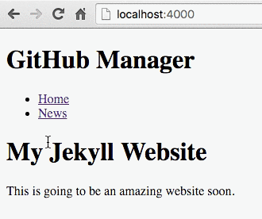
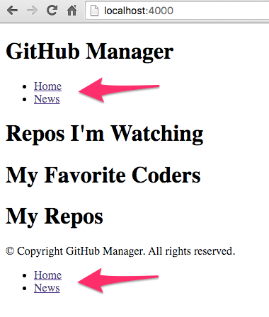
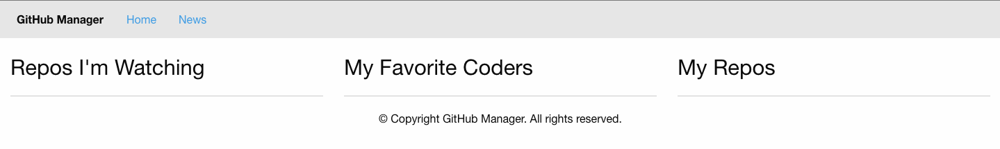
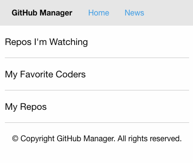

# Lesson 3: Extending Our Jekyll Website

For this tutorial, I have decided to create a fun personal GitHub website to manage all of our favorite Open Source Repos, Users, Gists, and Latest Coding News.

### 1. Creating Our Navigation

Since we will be creating multiple pages on our website, we will need to make sure we have a menu and navigation so that our visitors can find their way around.

Let's dive right in and start by creating a blog page. Let's call it `news.html`. We can also add a page heading below the front matter.

*/news.html*
```html
---
layout: default
---

<h1>News</h1>
```

Then we can jump back into our default layout file to add our navigation.

We also need to name our website appropriately.

*/_layouts/default.html*
```html
<!DOCTYPE html>
<html>
<head>
  <meta charset="utf-8">
  <title>GitHub Manager</title>
</head>
<body>

<header>
  <h1>GitHub Manager</h1>
  <nav>
    <ul>
      <li><a href="index.html">Home</a></li>
      <li><a href="news.html">News</a></li>
    </ul>
  </nav>
</header>

{{content}}

</body>
</html>
```

If we go to our browser and refresh the page, we should see:



### 2. Using Our BaseURL

If we went ahead and saved our changes, committed them, and push to GitHub, we'd see an issue with our navigation. This is because on our local computer the pages are at the root level but on our GitHub hosting the pages are one directory deeper.

This is where the baseurl that we created in Lesson 2-1 comes into play.

*_config.yml*
```yml
baseurl: /jekyll-github-pages-tutorial
```

Let's integrate this into our navigation now. To do this, we will use the variable `{{site.baseurl}}` to access server's __baseurl__ value. All the variables set via the command line and your `_config.yml` file are available through the `site` variable.

*/_layouts/default.html*
```html
...
<header>
  <h1>GitHub Manager</h1>
  <nav>
    <ul>
      <li><a href="{{site.baseurl}}/index.html">Home</a></li>
      <li><a href="{{site.baseurl}}/news.html">News</a></li>
    </ul>
  </nav>
</header>
...
```

> Don't forget to add the trailing slash after the baseurl variable.

We'll also take this opportunity to update our homepage `index.html`. This page will have 3 sections.

*/index.html*
```html
---
layout: default
---

<h1>Repos I'm Watching</h1>

<h1>My Favorite Coders</h1>

<h1>My Repos</h1>
```

Then finally:

1. Save
2. Commit
3. Sync

### 3. Learning About Includes

Another way to optimize our website by reducing duplicate code is to use __includes__.

Let's say we want to create a footer for our website and also include the navigation in it. We would then be using the same code in multiple places within our layout. To avoid this, we can use includes.

Let's create a folder called `_includes` and in it a file called `nav.html`. Then we can cut the nav from our `/_layouts/default.html` file and paste it into our `/_includes/nav.html` file. After that, we can add `` to any area we want to add our navigation. We'll add a footer as well so now our files should look like:

*/_includes/nav.html*
```html
<nav>
  <ul>
    <li><a href="{{site.baseurl}}/index.html">Home</a></li>
    <li><a href="{{site.baseurl}}/news.html">News</a></li>
  </ul>
</nav>
```

*/_layouts/default.html*
```html
...
<body>

<header>
  <h1>GitHub Manager</h1>
  
</header>

{{content}}

<footer>
  <p>
    &copy; Copyright GitHub Manager. All rights reserved.
  </p>
  
</footer>

</body>
...
```

And when we go back to our website in the browser, we'll see our navigation working in both the header and footer.



Let's go ahead and:

1. Save
2. Commit
3. Sync

### 4. Adding Some Style

So far we have learned quite a bit about the functionality of Jekyll but our site is looking pretty bleak. We should add some style and get a feel for what this website is really going to look like.

Adding style is just like you would in a regular html website. `<link rel="stylesheet" href="">`.

> This is not a tutorial in CSS or JavaScript so we will be using [Foundation 6](http://foundation.zurb.com/). I recommend taking some time on their website to read the docs.

We will also be creating our own CSS in `/css/custom.css` and our own JavaScript in `/js/custom.js`. When including our custom CSS and JavaScript files, we must remember to always prefix the location with `{{site.baseurl}}`.

To expedite the build, we can just copy/paste the following code over our existing code.

> We are also making our top menu fixed so we will be removing the footer navigation.

*/index.html*
```html
---
layout: default
---
<div class="expanded row">
  <div class="small-12 medium-4 columns">
    <h3>Repos I'm Watching</h3>
    <hr>
  </div>
  <div class="small-12 medium-4 columns">
    <h3>My Favorite Coders</h3>
    <hr>
  </div>
  <div class="small-12 medium-4 columns">
    <h3>My Repos</h3>
    <hr>
  </div>
</div>
```

*/news.html*
```html
---
layout: default
---

<div class="expanded column row">
  <h3>News</h3>
</div>
```

*/_includes/nav.html*
```html
<nav data-sticky-container>
  <div class="top-bar sticky" data-sticky data-options="anchor: body; marginTop: 0; stickyOn: small;">
    <div class="top-bar-left">
      <ul class="menu">
        <li class="menu-text">GitHub Manager</li>
        <li><a href="{{site.baseurl}}/index.html">Home</a></li>
        <li><a href="{{site.baseurl}}/news.html">News</a></li>
      </ul>
    </div>
  </div>
</nav>
```

*/_layouts/default.html*
```html
<!DOCTYPE html>
<html>
<head>
  <meta charset="utf-8">
  <title>GitHub Manager</title>
  <link rel="stylesheet" href="https://cdn.jsdelivr.net/foundation/6.2.0/foundation.min.css">
  <link rel="stylesheet" href="{{site.baseurl}}/css/custom.css">
</head>
<body id="body">

<header>
  
</header>

{{content}}

<footer>
  <p class="text-center">
    &copy; Copyright GitHub Manager. All rights reserved.
  </p>
</footer>

<script src="https://cdnjs.cloudflare.com/ajax/libs/jquery/2.1.3/jquery.min.js"></script>
<script src="https://cdn.jsdelivr.net/foundation/6.2.0/foundation.min.js"></script>
<script src="{{site.baseurl}}/js/custom.js"></script>
</body>
</html>
```

*/css/custom.css*
```css
header {
  margin-bottom: 20px;
}
.sticky {
  width: 100%;
}
```

*/js/custom.js*
```js
$(document).foundation();
```

Once we have completed these edits we can see that our website is starting to have some style!



And it is responsive so it looks great on mobile too!



Let's not forget to:

1. Save
2. Commit
3. Sync

### Moving Forward

Now that we have the foundation (no pun intended) of our website complete, I will be splitting up every section into its own lesson. The lessons will be shorter and easier to navigate when referencing in the future.

Continue to [Lesson 4: Permalinks](04-permalinks.md).
