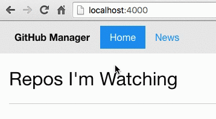

# Lesson 5: Showing the Active Page in our Nav

In order to improve our website's UX, we should add indicate which page we are currently on in the menu bar. This style is already a part of FoundationJS. We can do this by adding `class="active"` to the `<li>` of the current menu item.

*/_includes/nav.html*
```html
...
<ul class="menu">
  <li class="menu-text">GitHub Manager</li>
  <li class="active"><a href="{{site.baseurl}}/">Home</a></li>
  <li><a href="{{site.baseurl}}/news/">News</a></li>
</ul>
...
```

Now we can see that our `Home` link is highlighted.


But there is a problem. It doesn't change when we navigate to our `News` page.

To fix this, we need to use the Jekyll `if` statement. The format for an if statement in Jekyll is ``. So if we want to check if the current page is equal to the home page (or root), we would say `I'm Home`. The previous statment will output `I'm Home` whenever the current page is the homepage.

Let's update our navigation to output the class `active` for each current page.

*/_includes/nav.html*
```html
...
<ul class="menu">
  <li class="menu-text">GitHub Manager</li>
  <li class="active"><a href="{{site.baseurl}}/">Home</a></li>
  <li class="active"><a href="{{site.baseurl}}/news/">News</a></li>
</ul>
...
```

Back in our browser we can refresh the page and see it in action.



1. Save
2. Commit
3. Sync

Continue to [Lesson 6: Adding Content From GitHub's API](06-adding-content-from-githubs-api.md).
